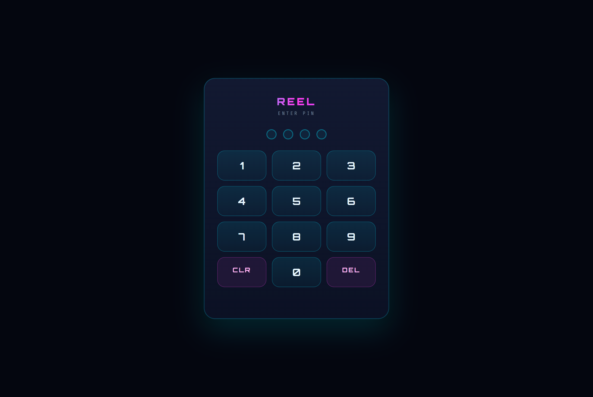
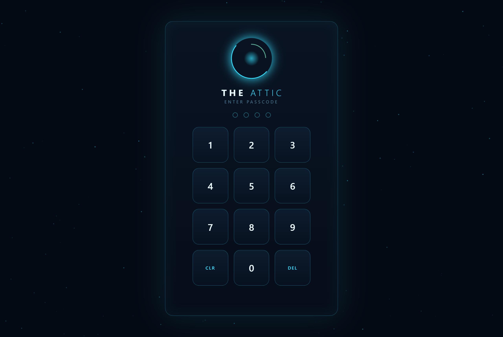

<div align="center">

# Sona

### Big Tech, but it lives in your house.

Netflix, iCloud, WhatsApp — except the server is a box in **your** home, and nothing ever leaves it.

Sona is a small kit of self-hosted apps that replace the parts of Big Tech you touch every day. They run on your own hardware and reach you anywhere over your own private network. No cloud account. No middleman decrypting your life in transit. No one watching what you watch.

**[Website](https://sona.casa) · [The apps](#the-apps) · [Quick start](#quick-start) · [How it stays private](#how-it-stays-private) · [License](#license)**

</div>

---

## Why

Every app you use daily quietly ships your life to someone else's computer. Your photos sit in their cloud. Your music is a subscription you rent forever. Your calls route through a server that could listen.

Sona is the opposite bet: **you already own a computer. Let it be the cloud.**

Point these apps at your own files, on your own machine, and reach them from your phone anywhere in the world — over an end-to-end-encrypted private network, not a company's servers. The difference isn't a privacy policy you have to trust. It's that the data physically never leaves your house.

## The apps

Three today. Each one is a small, pure-JavaScript Node server — no database engine to install, no native build step, no Docker required.

| App | Replaces | What it is |
|---|---|---|
| 🎞️ **Reel** | Netflix / Spotify | Your own media, streamed from your own files. Point it at a folder; it sorts everything and plays to any screen you own. No ads, no rent, no one logging what you watch. |
| 📷 **Attic** | iCloud Photos / Google Photos | A photo & video vault that never leaves your house. Shoot from any device's browser; every frame lands on your PC and tucks into a private, local vault. |
| 📞 **Kin** | WhatsApp / FaceTime | Private calls with the people you love, peer-to-peer. Your voice goes straight to them, device to device — no company sitting in the middle. |

> Coming later: **Ember** — your gaming PC, streamed to any browser (the "Stadia, but it's your rig" piece). It's Windows/NVIDIA-only and admin-install, so it ships as an optional add-on rather than part of the core kit.

## A look inside

Every app opens behind its own passcode — your house, your key.

| Reel | Attic | Kin |
|:---:|:---:|:---:|
|  |  |  |
| your media | your photos | your people |

## Quick start

You need **[Node.js 22.5+](https://nodejs.org)** (24 LTS recommended — the apps use Node's built-in SQLite). That's it for the core kit. `ffmpeg` is optional and only used by Reel (transcoding) and Attic (video); both work without it.

```bash
git clone https://github.com/Nabubito/sona.git
cd sona/apps/reel      # or attic, or kin
npm install
npm start
```

Then open the app in your browser (default ports: **Reel 3010 · Attic 3060 · Kin 3095**), set your passcode on first run, and point it at your folders. Each app is independent — run one, run all three, they don't collide.

Per-app setup lives in each app's own README:

- [`apps/reel`](apps/reel) — your media library
- [`apps/attic`](apps/attic) — your photo vault
- [`apps/kin`](apps/kin) — your private calls

## How it stays private

Getting to your apps from your phone across the internet is the part most "self-hosted" guides hand-wave. Sona's answer is **[Tailscale](https://tailscale.com)** (or any WireGuard mesh):

- Your traffic goes **device ↔ device directly**, end-to-end encrypted. The coordination server only swaps keys — it never sees your data.
- No public domain, no reverse proxy terminating your TLS at some company's edge, no port-forwarding your router.
- Bonus: it puts your phone and your home server on one virtual LAN, which quietly fixes the NAT problems that break peer-to-peer calls.

Install Tailscale on the home machine and on your phone, and every Sona app is reachable from anywhere — privately — with nothing exposed to the public internet.

*(You can absolutely run these on a plain LAN or behind your own reverse proxy instead. Tailscale is the recommended path, not a requirement.)*

## Design principles

- **Your data physically stays home.** No telemetry, no phone-home, no third-party analytics. Attic's "vault" is a plain folder on your disk — verified in the code, not promised in a policy.
- **Plain files, plain formats.** Reel plays your existing music/video files. Attic saves normal images into normal folders. Delete Sona tomorrow and your stuff is still just… there.
- **No heavy dependencies.** Pure JS. Node's built-in SQLite. No Postgres, no Redis, no native modules, no compiler. Clone and run.
- **Warm, not corporate.** These are apps for a home, not a data center. They should feel like it.

## Roadmap

- [ ] One-click Windows installer (portable Node + all apps + Tailscale join + first-run wizard)
- [ ] **Ember** game-streaming as an optional Pro add-on
- [ ] Self-hosted Tailscale control plane (Headscale) option — own even the key exchange
- [ ] Docker images for the Linux/NAS crowd

## Sona Pro & supporting the project

The apps here are, and will stay, free and open-source (AGPL-3.0) — self-host them forever, no strings.

The upcoming **one-click installer**, the **Ember** game-streaming add-on, and priority support will be a paid **Sona Pro** offering. That's what funds the open core. If you want the convenience layer — or just want to keep this alive — that's how. (Not available yet — [join the list at sona.casa](https://sona.casa).)

## Contributing

Issues, PRs, and "I ran this on my NAS and here's what broke" reports are all welcome. This is early — the apps are extracted from a personal home setup and are being generalized in the open. Rough edges are expected; tell us where they are.

## License

[GNU AGPL-3.0](LICENSE). Self-host freely. If you run a modified version as a network service, share your changes. Commercial/OEM licensing for the closed installer and Pro components is separate — reach out via [sona.casa](https://sona.casa).

<div align="center">

*My house. My rules.*

</div>
