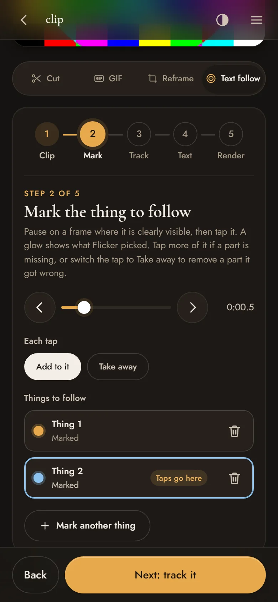
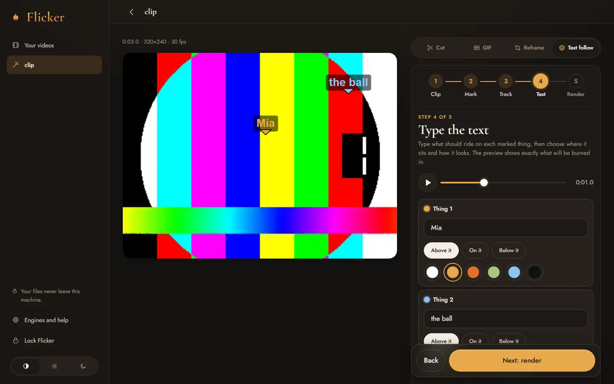

# Flicker

**Your video effects studio, at home.**

Drop a video from your phone or computer, then cut it, pull out the audio, loop it into a GIF, reframe it for the vertical feeds, burn words onto it, or make text follow something as it moves through the shot. Everything runs on your own machine with ffmpeg. Your files never go to anyone's cloud.

Part of [Sona](../..). Plain Node, zero npm dependencies, no build step.

## Run it

You need **Node.js 20+** and **ffmpeg** on your PATH. That is all the core studio needs.

```bash
cp config.example.json config.json   # optional: set a passcode, change limits
npm start
```

Open **http://localhost:4480** and enter your passcode. If you did not set one, Flicker makes one up on first run, prints it in the terminal, and keeps it in `data/passcode.txt`. Letters and numbers both work; it must be at least 8 characters (a shorter one is refused at start and the generated one is used, and printed, instead).

Installing ffmpeg: Windows `winget install Gyan.FFmpeg`, macOS `brew install ffmpeg`, Linux your package manager. Any full build works; burned in words need one with libass, which almost all include.

## What it does

| Tool | What you get |
|---|---|
| **Cut** | An exact cut of any range as an MP4 that plays everywhere, or just its sound as MP3, M4A or Opus. |
| **GIF** | A looping GIF of up to 20 seconds, at 320, 480 or 640 px, with a two pass palette so it looks clean. |
| **Reframe** | Refit a video to 9:16, 4:5, 1:1, 3:4 or 16:9. Crop to fill, a blurred copy of itself behind, or a solid colour. Drag to place, pinch or scroll to zoom. |
| **Words on the video** | On a cut, a GIF or a reframe: type your own lines, or (optional helpers) burn in what is heard, the published lyrics of a song timed to the singing, or the captions that came with an imported link. Pick the look, font and colour. |
| **Text follow** | Mark something in the shot, type some text, and the text rides on it through the clip (optional helper, needs an NVIDIA graphics card). |

The page is designed for a phone first: one column, big tap targets, and the main action always sits in a bar at the bottom of the screen. From 1024 px wide it gets a sidebar, and the studio splits into the picture on the left and the tools on the right. It is built on Sona UI, the design system shared by all five Sona apps, so it has the same lock screen as the others and follows your light or dark setting (or pick one under Theme in the menu).

| Phone | Desktop |
|---|---|
|  |  |

## Text follow, step by step

1. **Clip.** Set the start and end on the rail (up to 60 seconds) and tap *Use this clip*.
2. **Mark.** Pause on a frame where the thing is clearly visible and tap it. A glow shows what was picked. Tap more of it if a part is missing, or switch the tap to *Take away* to remove a part it got wrong. You can mark up to four things.
3. **Track.** Flicker follows each marked thing through the clip. Play it back with placeholder labels; if one wanders off, tap *Fix* on that moment, mark it again there, and track again.
4. **Text.** Type what should ride on each thing, and choose above, on or below it, the colour, look, font, size and pointer. The preview is exactly what gets burned in.
5. **Render.** Save it as an MP4, or a GIF when the clip is short enough.

## Optional helpers

Flicker checks for these at start (and when you tap *Check again* under Engines in the menu). Anything missing is switched off in the page with a note on how to add it. Nothing is ever downloaded or installed by Flicker itself.

| Helper | Unlocks | How to add it |
|---|---|---|
| **faster-whisper** | Heard words and lyrics | `pip install faster-whisper`, then download the model once while online: `python -c "from faster_whisper import WhisperModel; WhisperModel('small')"`. Runs on the CPU, one clip at a time, offline. |
| **SAM 2.1 tracker** | Text follow | A Python with PyTorch (CUDA build), SAM 2 (from the facebookresearch/sam2 project), `opencv-python` and `numpy`, plus the checkpoint `sam2.1_hiera_base_plus.pt` (or `_small.pt`). Point `tracker.python` and `tracker.checkpoints` at them. The tracker is stopped when idle, and by default it steps aside when something else (a game, another AI app) is using the graphics card. |
| **yt-dlp** | Link import (off by default, see below) | `pip install yt-dlp` or your package manager. Keep it updated. |
| **AcoustID key** | Naming a song from its sound, for lyrics | A free application key in `songId.acoustidKey`, and an ffmpeg with chromaprint in `songId.ffmpeg`. Without it, songs are named from the file name or by you. |

## Link import (off by default)

Flicker is a studio for your own files. If you also want to bring videos in from a link, turn it on in `config.json`:

```json
"linkImport": { "enabled": true }
```

**You are responsible for what you download.** Only bring in what you have the right to use.

When it is on, every fetch the engine makes is forced through a small guard built into Flicker. It refuses this machine, your home network, private overlay networks and cloud metadata addresses, it checks where a name really points before connecting (and connects to exactly that address, so a second DNS answer cannot sneak in), and it only allows the usual web ports. Add your own domains to `linkImport.refuseHosts` so a link can never make Flicker fetch them either. Formats the engine would hand to an outside player (RTMP, RTSP, MMS) or fetch without the proxy (FTP) are never picked, since those players ignore the guard. No cookies are ever used and nothing signs in anywhere.

Two limits to know about. The guard is a plain forward proxy on `127.0.0.1` with no password, so while link import is on, any other program already running on this machine could use it too (it only ever reaches public addresses). And for some encrypted HLS streams yt-dlp hands the download to ffmpeg, whose playlist reader follows the proxy for web addresses but, on older builds, could be pointed at raw network addresses a playlist names. Keep ffmpeg current (and yt-dlp updated) if you turn link import on. An imported video either opens in the studio (with its captions, if you pick a track) or is saved as a plain video or audio file.

## Configure

Everything lives in `config.json` (see `config.example.json`, every key is optional). The ones you are most likely to change:

| Key | What it does |
|---|---|
| `passcode` | Your unlock passcode, at least 8 characters. Or set `FLICKER_PASS`. |
| `host`, `port` | Default `127.0.0.1:4480`, this machine only. Use `0.0.0.0` to reach it from your phone over your own private network. |
| `workDir` | Where uploads and renders live while you work (default `data/work`). They are cleared on their own: open videos 6 hours after you last touch them, renders 60 minutes after they finish. |
| `limits` | Upload size and length, clip, GIF, follow and listening lengths, how many renders run at once, and disk guards. |
| `ffmpegThreads`, `lowPriority` | Keep the machine responsive while Flicker works. |
| `lyrics.enabled` | Set to `false` to never contact the lyrics service. |
| `tracker.worker` | Optional custom tracker for text follow: any script that speaks the same JSON lines protocol as `py/track.py` (described at the top of that file), run with `tracker.python`. Leave empty for the bundled SAM 2.1 worker. |

Environment overrides: `PORT`, `FLICKER_HOST`, `FLICKER_PASS`, `FLICKER_DATA_DIR`, `FLICKER_WORK_DIR`, `FLICKER_CONFIG` (path to another config file).

## How private is it?

The video you drop is copied into the work folder on this machine and processed there with ffmpeg. There is no account, no analytics and no telemetry. Two optional things can reach the internet, and only when you use them: the lyrics lookup (sends an artist and a song title to a public lyrics service when you pick *Lyrics*) and link import (off unless you turn it on). Speech to text and tracking run offline.

Signing in sets one shared session for the whole studio. *Lock* signs out only the device you tap it on; to sign every device out, stop Flicker, delete `data/session.key`, and start it again.

The page itself is locked down: one passcode gate in front of everything, a strict content security policy (no inline scripts, nothing loaded from anywhere else), and every value that reaches ffmpeg is a number Flicker clamped itself or a name from a fixed table, never text from the page.

## Reaching it from your phone

Bind to `0.0.0.0` and reach Flicker over a private mesh VPN (WireGuard, Tailscale or similar), so it is never exposed to the public internet. Do not put it on an untrusted network without TLS in front.

## Tests

```bash
npm test
```

Checks the egress guard (with a canary server that proves a check can fail), the input rules, and the ffmpeg argument builders. No network access or media files needed.

## License

[AGPL-3.0](../../LICENSE).
